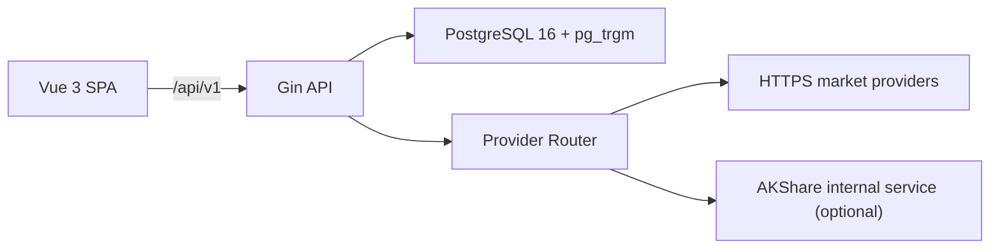

# Stock Predict 架构说明

## 总览

## 前端

- Vue 3、TypeScript、Pinia、Vue Router。
- Axios 默认使用 `/api/v1`，开发时由 Vite 代理到 Go API。
- 请求去重使用 `AbortController`；取消请求以 `CancelError` 拒绝，调用方可在
  `finally` 中清理 loading 状态。
- 写请求使用 HttpOnly CSRF Cookie 和 `X-CSRF-Token` 响应头。令牌只保存在
  前端内存，不从 `document.cookie` 读取。
- 搜索高亮采用文本分段渲染，不使用 `v-html`。
- 行情刷新设置集中在 `features/settings/store/settings.ts`。
- 交易时段使用 IANA 时区；美股使用 `America/New_York` 自动处理夏令时。

生产静态资源建议使用 `frontend/nginx.conf`，由静态站点层设置 CSP。Go API
响应头不能替代 SPA 静态站点的 CSP。

## Go API

`internal/app` 负责装配 PostgreSQL、仓储、领域服务、Provider Router、健康监控、
缓存、后台同步和 Gin 路由。

中间件包括请求 ID、结构化日志、panic recovery、明确 Origin 的 CORS、CSRF、
请求体限制、gzip、限流和管理员令牌认证。

`TRUSTED_PROXIES` 必须配置实际反向代理 IP/CIDR。未配置时不信任
`X-Forwarded-For`；部署在代理后必须配置，避免所有客户端共享代理 IP 限额。

## 数据库与迁移

PostgreSQL 是唯一持久化来源，`pg_trgm` 用于代码和拼音检索。

- `cmd/migrate` 执行幂等 schema 迁移。
- `schema_migrations` 记录已应用版本。
- PostgreSQL advisory lock 防止多实例并发迁移。
- 旧文本 `updated_at` 使用类型转换迁移，不删除历史列。
- 生产 API 默认 `RUN_DATABASE_MIGRATIONS=false`。
- 默认股票只在空表时种入，不覆盖已同步股票。

## 数据源

公网数据源必须使用 HTTPS。HTTP 只允许指向 `localhost`、`127.0.0.1` 或 `::1`
的内部服务。

公开 `/api/v1/market/health` 不返回底层错误文本。BiyingAPI 错误在进入日志和
健康监控前移除 licence。

AKShare 是可选内部 FastAPI 服务：

- 默认绑定 `127.0.0.1:8900`
- 无浏览器 CORS
- 数据端点要求 `AKSHARE_SERVICE_TOKEN`
- 股票同步使用 POST
- 上游异常返回通用 502

## 健康与测试

- `/api/v1/health/live`：进程存活
- `/api/v1/health/ready`：数据库可连接
- `/api/v1/health`：兼容 readiness
- `/api/v1/metrics`：生产应由代理或网络策略限制

Go 集成测试为每个测试创建独立 PostgreSQL schema，并通过 `t.Cleanup` 删除，
允许包并行和重复测试。

质量门禁位于 `.github/workflows/ci.yml`、`scripts/verify-api-contract.ps1` 和
`scripts/verify-commercial-readiness.ps1`。
